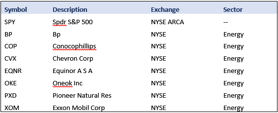

# Renewable Energy

Joshua Bond, Harry Torres, Raquel Quaglia

## Overview

Our motivation for choosing renewable energy as a topic for research and analysis is partially attributed to living in one of the largest energy capitals in the World, but also, because of the
ever-growing effort to transition away from non-renewable resources. We seek to better understand the effect of renewable energy on electricity generation and prices, industry, and financial markets.

To this end, we established three questions to assist in guiding our research and analysis:

1. How has electricity generation from non-renewable and renewable sources changed over time, what percentage of the total electricity generation does each source account for, and what is the relationship between electricity sources and the costs associated with getting electricity to the end user and retail cost of electricity?
2. How has renewable energy consumed in the industrial sector influenced the manufacturing output within the U.S., and what impact does it have on industry in the financial markets?
3. What could be more profitable, a Renewable Energy Stocks Portfolio in a scope of 5y, 10y and 15y, a Traditional Energy Stocks Portfolio for the same time, or a Diversified Energy Portfolio?

## 1: Electricity Generation and Prices

The question I sought to answer involved multiple parts. My approach began by gathering electricity generation data from all energy sources. To see the general composition of the electricty generation sector as a whole. I realized that monthly data was too noisy on the line graph, so the majority of the data was converted to an annual timeframe. Additionally, I decided to combine the varying renewable energy sources (hydro electric, geothermal, wind, and solar) to allow for better comparison between non-renewables and renewables. Prior to this, the values for renewables were so small relative to the other sources that it was hard to actually determine anything from visualizations.

After annualizing the data, I was able to more clearly see how the different electricity generation sources have changed over time.

Admittedly, I was surprised by the rapid growth of natural gas over the last three decades compared to the other sources. I assumed that it would be a front-runner, however, I did not expect its cumulative growth to dwarf all of the others by such a large degree.

To further understand the composition of non-renewable and renewable sources in electricity generation, I wanted to see the percentage of the total that each made up. In the visuals dedicated to this, it is a little easier to interpret how the percentage of renewables have fluctuated and slowly grown. Similarly, one can see how natural gas has steadily grown to account for a larger and larger percent of the total electricity generation. On the other hand, it appears that the percent of the market attributed to nuclear energy has remained relatively stable over time, while coal and petroleum have declined to varying degrees.

My interest in the last aspect of the question began from a simple curiousity about the cost of electricity over time as new technologies have developed and efficiencies have likely increased. However, my interest was amplified drastically due to the extreme winter weather that hit Houston, TX, the week of February 14th, 2021. During this time, the large majority of the Texas electrical grid failed and much of the state was left without power for several days. Speculation spread across Texas as people tried to understand how such a thing could happen. The frustration felt by much of the state throughout this ordeal motivated me to look deeper into electricity costs.

I began by collecting data on the cost of electricity to end users (I interpreted this to be the cost for producers to *get* electricity to consumers) and the residential retail cost of electricity. From this data, I created a visual to compare the two. I was taken aback by what I found. Of course, in business a profit margin of some sort is needed; However, I found that the retail cost of electricity had risen 57% since 1995, while the electricity cost to end users had actually fallen by 0.4 cents.

After my findings on the rise in retail cost, I decided to attempt to understand the relationship between the different electricity generation sources and the different costs. First, I checked the correlation of the sources and cost variables. I expected to find some degree of positive correlation, since more generation would likely result in higher costs. The results fit my assumption for the most part, but there was a negative correlation between coal and petroleum and the different costs. After some reflection, this made sense because coal and petroleum use as a whole has been decreasing in recent years due to the effort to move towards cleaner energy.

The correlation results allowed me to see the degree of the relationship between the different variables, but I wanted to see if the electricity sources had any significant causal effect on the two costs. To achieve this I needed to perform a regression. The difference between correlation and regression is that the former captures the level of interrelation between two variables, while the latter is based on the causality of one variable on another. In addition, the correlation between two variables is the same for x and y as it is for y and x. In contrast, a regression will yield different results depending on whether you regress *x on y* or *y on x*.

I decided I would use a linear regression, due to a shortage of time. This is one of the more basic regression types, but is still useful in drawing conclusions about data. To begin this process, I first needed to see the distribution of the variables to check for linearity normality because these are two of the primary assumptions of a linear regression.

From the distribution visuals, I could see that several of the variables were skewed so I had to transform the data to make it more appropriate for my needs. To accomplish this, I performed a logarithmic transformation on the right-skewed variables, and a exponential transformation on coal since it was left-skewed. The intented effect of these transformations, is to dampen the effect that outliers have on the model performance.

This resulted in more normally distributed data.

*(note: I must concede that a simple linear regression was likely not the best type to be used on this data since non-linear relationships were present along with other complications that were not completely resolved by transforming the data (i.e. multicollinearity, endogeneity, omitted variable bias, etc.). That being said, I feel it provided some basic insight into the causal relationship the source variables have on the dependent cost variables. A greater understanding could be attained by modifying the regression model, and/or using a more appropriate/sophisticated regression model.)*

The next step was to perform the regressions.

I started by regressing *all* electricity generation sources on the two different costs. The first regression involved electricity cost (to end user). In regression analysis, the R-squared coefficient (the coefficient of determination) measures the goodness of fit for the model. In other words, it measures what proportion of the variability in the dependent variable can be explained by the independent (explanatory) variables in the model. The adjusted R-squared coefficient takes this a step further. It measures the total variability explained by the model, while also taking into consideration the number of variables in the model. This is because as you include additional variables in the model, the R-squared increases. Therefore, it is thought that since the adjusted R-squared penalizes the excessive use of variables, it is the more accurate of the two. Additionally, one should also consider the statistical significance of each coefficient among several other factors when determining the performance of a regression model. But for the sake of simplicity, I focused primarily on the adjusted R-squared value in this case.

After looking at the causality of all sources, I split the non-renewable and renewable energy variables into two separate groups and regressed each group on the two different cost variables.

All in all, it appears that the explanatory power of the different sources was considerably larger for the residential retail cost of electricity compared to the cost of electricity to the end consumer. Moreover, my initial assumption after reviewing the regression results is that the model is either lacking key explanatory variables for the electricity cost to the end user since the adjusted R-squared for these regressions were so low, or it may be that electricity generation sources simply have little causal effect on the variability in electricity cost. At the same time, despite the large adjusted R-squared values seen in the regressions on residential retail cost, I am skeptical as to their accuracy due to possible flaws in the model design. Further analysis is necessary to discover the true causal relationship of these factors.

## 2: Renewable Energy and Industry

The first analysis I did was to plot out the renewable energy consumed over the last 19 years by year in a bar graph. This plot allowed me to set-up a baseline to illustrate renewable energy consumption in the industrial sector.

The next analysis I did was the Industrial Production Index, where I did a line plot over the same period. I felt this data was important to show the industrial sector index increase in manufacturing output over the years compared to the renewable energy consumption.

The next graph was another line plot of the XLI closing price for the Industrial Sector Stock Fund over the same period. The last set of data was critical to my analysis as I intended to show that as the consumption of renewable energy increased in the industrial sector, along with the output in manufacturing this translated into huge increase value and wealth for companies in the industrial sector of the market.

To further bolster my analysis, I did a scatter plot and a correlation heatmap of both the Industrial Production Index and the XLI Closing Price. My findings were insightful as they produced a Correlation of 0.82. This shows a strong uphill positive linear relationship between both datasets.

After the completion of my analysis, I was able to infer that there is a strong relationship between the consumption of renewable energy over the years and the increase in manufacturing output in the industry during  that same period. Furthermore, this relationship also has an impact with companies in the industrial sector as their wealth also increased by 272% over that same period. The correlation of 0.82 between the Industrial Index and the XLI closing prices strongly validates this connection.

Below is a snippet of code involving my data cleanup and date splicing to extract the correct portion of the dataset:

## 3. Energy Portfolio Data Analysis

The question came out for the time we are living now where the Renewable Energy is more popular, and we have a good merge of new companies working in this area and trying to escalate in the stock market. Also, the traditional energy stocks (fossil fuel) look like they are starting to recover from the bearish trend, so I wanted to evaluate the opportunity to invest in these sectors. Looking into the best options, I checked several web sites for the best energy stock recommendations such as, [Investopedia](https://www.investopedia.com/top-energy-stocks-4582081), and found data for the stocks using google finance in the google spread sheet for the data analysis, and I used ALPACA_API to simulate various scenarios and different time frames using Monte Carlo.

To create my portfolios, I started creating a Data Base by using google finance and downloading my data as a .csv file:

Alternative Renewable Energy Portfolio

Traditional Energy Portfolio

Stocks CLOSING price…

Import and read the data in JupyterLab by using **import csv** and ALPACA-API, and clean my nulls and na's using df.isnull().sum() and df.dropna().

Once the data was cleaned the Portfolios were analyzed in 4 different Investment
Weights distribution:

1. Equally Weighted
2. Market Capital
3. Dividend Yield
4. 10 Years Cumulated Return.

Example:

The first analysis was to calculate the cumulative returns and determine the risk of each portfolio by estimating Volatility, Beta, Correlations and Sharpe Ratio.

These results were compared with the INDEX S&P500.

Data Analysis reflect as best opportunity to invest is in a Portfolio with Diversified Energy Stocks.

The next steps after the Risk/Reward analysis were done was to Simulate the returns for the portfolios using Monte Carlo and running 3 different forecasts for 5, 10 and 15 years.

The best Portfolios were:

**Traditional Energy (Fossil fuels) Portfolio:**

** Monte Carlo simulation weighted by Stock 10 years Cumulated Return

95% ci Upper (5 Years) = $25506.99 and 95% ci Lower (5 Years) = $68846.43

95% ci Upper (10 Years) = $108105.55 and 95% ci Lower (10 Years) = $375724.94

95% ci Upper (15 Years) = $286204.82 and 95% ci Lower (15 Years) = $1606266.28

**Alternative RE Portfolio:**

** Monte Carlo simulation weighted by Stock Market Capital

95% ci Lower (5 Years) = $40400.39 and 95% ci Upper (5 Years) = $125944.46

95% ci Lower (10 Years) = $199522.08 and 95% ci Upper (10 Years) = $1004792.76

95% ci Lower (15 Years) = $1535192.72 and 95% ci Upper (15 Years) = $8924420.21

**Diversified Energy Portfolio:**

** Monte Carlo simulation weighted Equally

95% ci Lower (5 Years) = $42685.88 and 95% ci Upper (5 Years) = $124521.67

95% ci Lower (10 Years) = $335381.78 and 95% ci Upper (10 Years) = $877430.53

95% ci Lower (15 Years) = $1850660.48 and 95% ci Upper (15 Years) = $7563488.9

Overall, the best Cumulated Returns Predictions is presented by the **Alternative RE Portfolio**.

There were 4 weighted scenarios analyzed for each Portfolio and 3 forecasts for a
total of 36 code runners.

## Resources

[U.S. Energy Information Administration/cost of fuels to end users](https://www.eia.gov/totalenergy/data/browser/index.php?tbl=T01.06#/?f=M&start=199501&end=202101&charted=4-7-10-13)

[U.S. Energy Information Administration/electricity net generation](https://www.eia.gov/totalenergy/data/browser/index.php?tbl=T07.02A#/?f=M)

[U.S. Energy Information Administation/average retail prices of electricity](https://www.eia.gov/totalenergy/data/browser/index.php?tbl=T09.08#/?f=M)

[ETF Database/XLI index price](https://etfdb.com/etf/XLI/#etf-ticker-profile)

[U.S. Energy Information Administration/renewable energy consumption](https://www.eia.gov/totalenergy/data/browser/index.php?tbl=T10.02B#/?f=A&start=1949&end=2019&charted=11-17)

[U.S. Energy Information Administration/energy consumption by sector](https://www.eia.gov/totalenergy/data/browser/index.php?tbl=T02.01#/?f=A)

[U.S. Bureau of Labor Statistics/industrial prod index](https://www.bls.gov/ppi/)

[Google Finance](https://www.google.com/finance)
